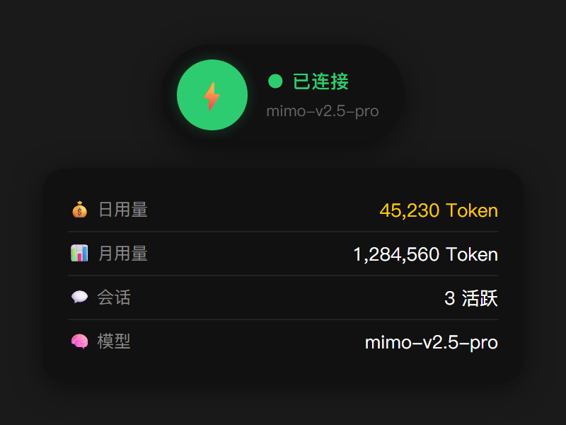

<div align="center">

# 🖥️ Hermes Dock

**macOS 灵动岛风格的 Windows 桌面悬浮小组件**


<br/>

一款灵感来源于 Apple 灵动岛的桌面小组件，实时监控 Hermes Agent 网关状态、Token 用量、会话信息。无边框透明悬浮窗，支持拖拽定位、流畅动画、主题切换和中英文国际化。

</div>

---

## 📋 目录

- [功能特性](#-功能特性)
- [效果预览](#-效果预览)
- [环境要求](#-环境要求)
- [安装步骤](#-安装步骤)
- [启动方式](#-启动方式)
- [使用说明](#-使用说明)
- [配置说明](#-配置说明)
- [项目结构](#-项目结构)
- [开发说明](#-开发说明)
- [致谢](#-致谢)
- [License](#-license)

---

## ✨ 功能特性

| 功能 | 说明 |
|:---|:---|
| 🟢 **网关状态监控** | 实时检测 Hermes Agent 网关运行状态（在线/离线/处理中） |
| 💰 **Token 用量统计** | 读取 `state.db` 数据库，展示当日/当月 Token 消耗量 |
| 💬 **会话信息** | 显示当前活跃会话数量 |
| 🧠 **模型信息** | 自动读取 `config.yaml` 展示当前使用的 AI 模型名称 |
| ⚡ **实时处理状态** | 彩色指示灯动画，展示 AI 当前操作（思考/搜索/写文件等 20+ 种状态） |
| 🖱️ **自由拖拽** | 支持鼠标拖拽到屏幕任意位置，适配多显示器 DPI 缩放 |
| 🎬 **流畅动画** | EaseOutCubic 缓动动画，展开/收起丝滑流畅 |
| 🌗 **主题切换** | 暗色（Dark）/ 亮色（Light）双主题一键切换 |
| 🌐 **中英文支持** | 界面完整中文/English 国际化 |
| 🚀 **开机自启** | 支持设置 Windows 开机自动启动 |
| 🔌 **一键启动网关** | 从设置面板直接启动 Hermes Agent 网关 |
| ☕ **支持作者** | 内置爱发电链接，支持打赏 |

### 🎨 状态指示灯

| 状态 | 颜色 | 说明 |
|:---:|:---:|:---|
| 🟢 | 绿色 | 网关在线，正常运行 |
| 🔴 | 红色 | 网关离线 |
| 🟠 | 橙色（呼吸动画） | AI 正在处理任务 |

### 🤖 处理状态识别

Dock 能自动识别并展示 AI 当前的操作类型：

| 工具类型 | 展示 | 工具类型 | 展示 |
|:---|:---|:---|:---|
| `terminal` | 💻 执行命令中 | `web_search` | 🔍 搜索中 |
| `read_file` | 📖 读取文件中 | `write_file` | ✍️ 写入文件中 |
| `patch` | 🔧 修改文件中 | `search_files` | 🔎 搜索文件中 |
| `delegate_task` | 🔀 分派任务中 | `memory` | 🧠 记忆中 |
| `vision_analyze` | 👁️ 分析图片中 | `thinking` | 💭 思考中 |
| `debugging` | 🐛 调试中 | `optimizing` | 🚀 优化中 |

以及更多 `reasoning`、`analyzing`、`planning`、`drafting` 等 20+ 种状态...

---

## 📸 效果预览

> 💡 请将截图放置在项目根目录下，以下为占位引用。

### 展开面板效果

| 数据面板 | 设置面板 |
|:---:|:---:|
| Token 用量、会话、模型 | 语言、主题、开机自启、网关 |




---

## 📦 环境要求

| 依赖 | 最低版本 | 说明 |
|:---|:---|:---|
| **Node.js** | 18.0+ | 推荐 LTS 版本 |
| **npm** | 9.0+ | 随 Node.js 安装 |
| **Windows** | 10 / 11 | 仅支持 Windows 系统 |
| **Hermes Agent** | — | 需要已安装并配置 Hermes Agent |

---

## 🚀 安装步骤

### 1. 进入项目目录

```bash
cd D:\Hermes\tools\hermes-dock
```

### 2. 安装依赖

```bash
npm install
```

### 3. 确认 Hermes Agent 数据目录

Dock 会自动读取以下目录的数据（默认 `~/.hermes`）：

| 文件 | 用途 |
|:---|:---|
| `gateway_state.json` | 网关运行状态 |
| `live_status.json` | 实时处理状态 |
| `state.db` | Token 用量数据库（SQLite） |
| `config.yaml` | 模型配置 |

如自定义了 Hermes Home 路径，需设置环境变量：

```bash
set HERMES_HOME=D:\your\custom\path
```

---

## 🎬 启动方式

### 方式一：双击启动脚本（推荐） ⭐

直接双击项目根目录下的 `start.bat`，自动设置编码和启动参数。

```bat
@echo off
chcp 65001 >nul
title Hermes Dock
cd /d "%~dp0"
set ELECTRON_DISABLE_GPU_CACHE=1
npx electron . --disable-gpu-cache
```

### 方式二：npm 启动

```bash
npm start
```

### 方式三：打包后运行

```bash
npm run build
# 生成 dist/HermesDock.exe，双击即可运行
```

---

## 📖 使用说明

### 🟢 基本交互

| 操作 | 效果 |
|:---|:---|
| **单击** 圆球 | 展开数据面板（Token/会话/模型信息） |
| **双击** 圆球 | 展开设置面板（语言/主题/开机自启） |
| **单击空白区域** | 收起所有面板 |
| **鼠标按住拖拽** | 移动 Dock 到任意位置 |
| **右键** Dock | 关闭退出 |

### 📊 数据面板（单击展开）

展开后显示以下实时数据，每 5 秒自动刷新：

| 字段 | 说明 |
|:---|:---|
| 💰 日用量 | 当日 Token 消耗量（输入 + 输出 + 推理） |
| 📊 月用量 | 当月累计 Token 消耗量 |
| 💬 会话 | 当日活跃会话数量 |
| 🧠 模型 | 当前配置的 AI 模型名称 |

### ⚙️ 设置面板（双击展开）

| 设置项 | 说明 |
|:---|:---|
| 🌐 **语言** | 切换中文 / English |
| 🎨 **主题** | 切换暗色 / 亮色主题 |
| 🚀 **开机自启** | 开启/关闭 Windows 开机自动启动 |
| 🔌 **网关** | 点击按钮一键启动 Hermes Agent 网关 |
| ☕ **请作者喝奶茶** | 点击跳转爱发电页面 |

### 🖱️ 拖拽移动

- 按住圆球并拖动鼠标即可移动 Dock 位置
- 内置 5px 拖拽阈值，避免误触
- 完美适配多显示器 DPI 差异
- Dock 窗口始终置顶显示

### 🎬 动画效果

- **展开/收起**：EaseOutCubic 缓动动画，350ms 过渡
- **状态指示灯**：处理中时橙色呼吸动画
- **文字**：打字机效果逐字显示处理状态
- **随机颜文字**：展示可爱颜文字如 `(⊙_⊙)`、`(◕‿◕)` 等

---

## ⚙️ 配置说明

配置文件路径：`~/.hermes/hermes-dock-settings.json`

（即 `%USERPROFILE%\.hermes\hermes-dock-settings.json`）

### 配置项说明

| 字段 | 类型 | 默认值 | 说明 |
|:---|:---|:---|:---|
| `language` | `string` | `"zh"` | 界面语言，`"zh"` 中文 / `"en"` English |
| `theme` | `string` | `"dark"` | 主题风格，`"dark"` 暗色 / `"light"` 亮色 |
| `autoStart` | `boolean` | `false` | 是否开机自启动 |

### 配置文件示例

```json
{
  "language": "zh",
  "theme": "dark",
  "autoStart": false
}
```

> 💡 推荐通过双击 Dock → 设置面板来修改配置，无需手动编辑 JSON 文件。

---

## 📁 项目结构

```
hermes-dock/
├── main.js                  # Electron 主进程（数据读取、IPC、窗口管理）
├── package.json             # 项目配置和依赖
├── package-lock.json        # 依赖锁定文件
├── start.bat                # Windows 启动脚本
├── src/
│   ├── index.html           # 渲染进程（UI 界面和交互逻辑）
│   └── index.html.bak       # 界面备份文件
├── skills/                  # 开发参考文档
│   ├── hermes-dock-project.md
│   ├── desktop-status-monitor-guide.md
│   ├── electron-widget-guide.md
│   ├── electron-multi-monitor-drag.md
│   └── hermes-agent-status-integration.md
├── dist-packaged/           # 打包输出目录
├── cache/                   # 缓存目录
└── node_modules/            # 依赖包
```

### 核心文件说明

| 文件 | 职责 |
|:---|:---|
| `main.js` | 主进程：读取网关状态、SQLite 数据库、配置文件；管理窗口创建、拖拽、动画、IPC 通信 |
| `src/index.html` | 渲染进程：全部 UI（HTML/CSS/JS）、状态展示、交互逻辑、国际化文本 |

### 依赖说明

| 依赖 | 类型 | 用途 |
|:---|:---|:---|
| `electron` | devDep | 桌面应用框架 |
| `sql.js` | dep | 纯 JS 的 SQLite 实现（无需原生编译，读取 state.db） |
| `js-yaml` | dep | 解析 config.yaml 配置文件 |
| `electron-builder` | devDep | 打包工具 |
| `electron-rebuild` | devDep | 原生模块重编译 |

---

## 🔧 开发说明

### 开发环境搭建

```bash
# 安装依赖（包括 devDependencies）
npm install

# 启动开发模式
npm start
```

### 打包为独立可执行文件

```bash
npm run build
```

打包配置在 `package.json` 的 `build` 字段：

| 配置项 | 值 |
|:---|:---|
| 应用 ID | `com.hermes.dock` |
| 产品名 | `Hermes Dock` |
| 输出目录 | `dist/` |
| 目标格式 | `portable`（单文件 exe） |
| 输出文件 | `HermesDock.exe` |

### 技术架构

```
┌─────────────────────────────────────────────────┐
│                   Electron App                    │
├──────────────────────┬──────────────────────────┤
│     Main Process     │    Renderer Process       │
│     (main.js)        │    (src/index.html)       │
│                      │                           │
│  · 读取 gateway_state │  · UI 渲染 (HTML/CSS)     │
│  · 读取 live_status   │  · 状态展示逻辑           │
│  · 读取 state.db      │  · 用户交互处理           │
│  · 读取 config.yaml   │  · 国际化文本             │
│  · 窗口管理/拖拽/动画 │  · 主题切换               │
│  · IPC 通信           │  · IPC 通信               │
├──────────────────────┴──────────────────────────┤
│              ~/.hermes/ (数据源)                   │
│  gateway_state.json │ live_status.json           │
│  state.db (SQLite)  │ config.yaml                │
└─────────────────────────────────────────────────┘
```

---

## 💖 致谢

如果 Hermes Dock 对你有帮助，欢迎请作者喝一杯奶茶！☕

🔗 **爱发电**：[https://ifdian.net/a/Youtiaowei](https://ifdian.net/a/Youtiaowei)

---

## 📄 License

[MIT License](LICENSE) © 2024

```
MIT License

Permission is hereby granted, free of charge, to any person obtaining a copy
of this software and associated documentation files (the "Software"), to deal
in the Software without restriction, including without limitation the rights
to use, copy, modify, merge, publish, distribute, sublicense, and/or sell
copies of the Software, and to permit persons to whom the Software is
furnished to do so, subject to the following conditions:

The above copyright notice and this permission notice shall be included in all
copies or substantial portions of the Software.

THE SOFTWARE IS PROVIDED "AS IS", WITHOUT WARRANTY OF ANY KIND, EXPRESS OR
IMPLIED, INCLUDING BUT NOT LIMITED TO THE WARRANTIES OF MERCHANTABILITY,
FITNESS FOR A PARTICULAR PURPOSE AND NONINFRINGEMENT.
```

---

<div align="center">

**Hermes Dock** — 让你的 AI 助手状态一目了然 ✨

Made with ❤️ for the Hermes Agent community

</div>
